# Task App V2

A todo list app built using Spring Boot 4 and the H2 database.

## Start Here

### Start Here

Ready to put your Java skills to work?

In this Devtiro build I'll guide you through the steps to develop a task
tracking web app using Java and Spring Boot.

But this won't be a simple copy and paste exercise. Along the way, we'll cover
the Spring Boot theory that you _need_ to know.

My name is Aaron Bourne. I started coding in 2008. Since then I've turned a
nerdy fascination into a fulfilling career, developing software and leading teams.

I now teach the same software development skills I use professionally through
Devtiro, my education business. You can find
[Devtiro on YouTube](https://www.youtube.com/@devtiro).

Now that we're acquainted, let's answer some questions.

Starting with, "What's a Devtiro build anyway?"

#### What's a Devtiro Build?

Well, we're going to build an app together! I'll guide you through each step.

To achieve this I've created the following for you:

- This doc.
- A guided build video you can watch on YouTube.
- Reference source code you can download on GitHub.
- A user interface (UI) you can run on your machine.

Better yet, I'm giving them to you for **free**.

My goal is to give you everything you need to build your first web app using
Java and Spring Boot.

How do you get the build resources? You'll find the links at the top of this page.

I'll show you how to get the UI later in the build when it makes the most sense.

Now to guess your next question, "Should I build this app?"

#### Should I Build This App?

##### What You Need to Know

If you have a solid understanding of Java and you are new to Spring Boot, this
build is for you.

If you're new to Java, or software development in general, **this build will be
too advanced**.

Ideally you have used Java professionally. Perhaps you write tests in Java, or
perhaps you use Java to build something other than Spring Boot web apps.

If you don't meet these criteria yet, no problem. The good news, you can
learn all of this online for free! You can always come back to this build when
you're ready.

##### Coding Style

I believe clean code is a _great_ idea. But more than that, I believe it's a
necessary part of professional software development.

Not everyone shares my opinion, and that's OK. I'm not here to try and
convince you otherwise.

That said, the code we write in this build follows my interpretation of clean
code.

We'll use the patterns and conventions that I, and many others, use to write
production code every day.

It's not the most concise code, nor is it the _cleverest_. Because that's not
how you win at professional software development. You win when you write code
that's _maintainable_.

If you're against writing clean code, or looking for something deliberately
obscure, you won't find it here. Happy searching, no hard feelings!

If you're excited by the idea of developing an app like we do professionally, I
encourage you to read on.

##### The Devtiro Approach

The goal of a Devtiro build isn't to teach you everything there is to know.

The goal of a Devtiro build is to teach you the most important 20%.

Have you heard of the Pareto Principle? I won't bore you with all the details
here. Put simply it means "a small number of inputs often produce most of the
output".

Put another way, I've tried to identify the _most important_ things you must
know to build a task app with Java and Spring Boot. Naturally, I've left a lot
out. But, I believe what's left should equip you with what you need to get the
job done, and do it well.

That said, you **will** have questions along the way. That's normal and part
of the learning process.

Whenever you go looking for an answer to your question, you're learning.
That's exactly what you want. That's progress!

Let's explore where you can look for those answers.

#### Help & Support

When it comes to support, it's just not possible for me to help everyone
individually. Therefore, **I can't respond to your direct support requests**.

Whenever you get stuck, treat it as part of the learning process — searching
for the answer is how the skill sticks.

#### Development Tools

This build requires the following development tools:

- The Java Development Kit (JDK)
- The IntelliJ IDEA IDE
- Docker

All of these tools are freely available online. You don't have to purchase
anything for this build.

#### Software Versions

This build targets version `25` of Java and version `4.0.X` of Spring Boot.

If you decide to use a different version of Java or Spring Boot then the steps
in this build **may not work for you**.

Please use the versions specified in the build whenever possible.

#### Errata

I devote a lot of time and effort in creating Devtiro builds for you.
However, as with all creative works, it's possible there may be some
errata present.

If you believe you have found a technical inaccuracy, or other errata, you
may report it by emailing contact@devtiro.com.

## Build Overview

### Project Brief Overview

What does our app need to do? Let's explore this build's requirements.

#### The 10,000 Foot View

We're going to build an app in which a user can capture tasks they
plan to complete in the future.

Apps like this are sometimes called "todo list" or "reminder" apps.

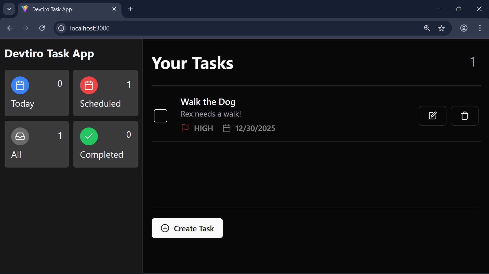

The principle is simple, the user creates a "task" which might be, say,
"Walk the dog".

They may add more details in the form of a _description_, like "Take Rex to the
park".

They may add a _due date_ that they aim to complete the task by.

They may rate the _priority_ of the task, is it high, medium, or low priority?

But the goal of every task is always the same, to remember and complete that
task.

By now you likely get the gist of what we're to build. Is it enough to start
coding? Not quite, let's see how to capture this app's requirements.

#### What's a User Story?

We need to get more specific on what we're going to build, so we capture this
build's requirements using a technique called "user stories".

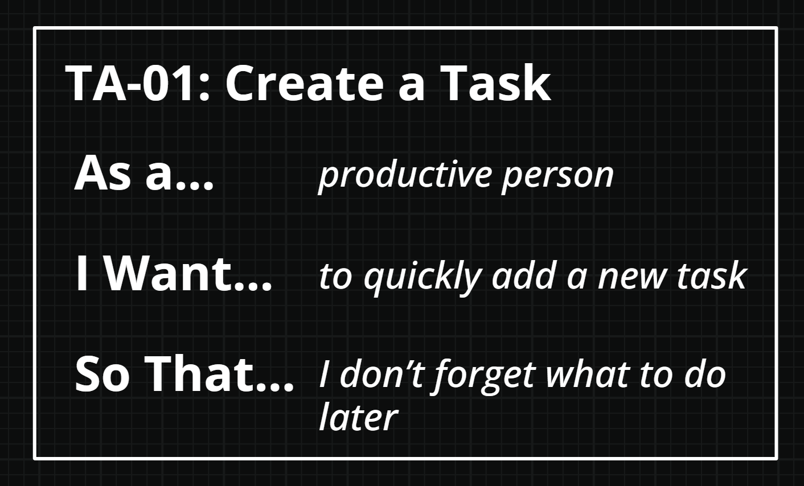

It's a simple, but powerful, technique you'll often see used in Agile
development teams.

Variations exist, but here's the Devtiro approach.

##### Title

Each user story has a title that summarises the purpose of that story. An
example may be "Create a Task".

To help identify each user story I use a coded prefix, so the full title is
"TA-01 - Create a Task".

This user story is about creating a task.

##### As A, I Want, So That

Each user story follows a specific three-sentence structure.

The first sentence starts "As a", such as "As a productive person". This
tells you _who_ the user story is about. In this case a "productive person".

The second sentence starts "I want", such as "I want to be able to quickly
add a new task". This line tells us _what_ the user story needs
us to deliver.

The final sentence starts "So that", such as "So that I don't forget about
what I need to do later". This tells us _why_ we're implementing the user story.

A traditional requirement like "The system shall capture a user's tasks", tells
us _what_, but our user story tells us _who_, _what_, and _why_.

This extra context is valuable, and that's why we use user stories.

##### Acceptance Criteria

Finally, every Devtiro user story has a set of acceptance criteria.

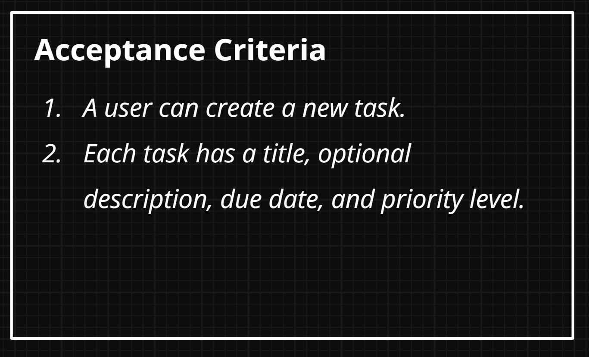

The three-sentence structure by itself is still a bit vague, that's where the
acceptance criteria come in.

Acceptance criteria are sentences that evaluate to either true or false.

The goal is to get all the user story's acceptance criteria to true. That's when
you can say you've completed the story.

For example, "A user can create a new task" starts off false at the start of the
project. However, once we've written the code to allow a user to create a task,
this acceptance criteria becomes true.

Let's explore this build's user stories:

#### Task App User Stories

In total this build has four user stories:

##### TA-01 - Create a Task

**As a** productive person.

**I want** to quickly add a new task.

**So that** I don't forget what to do later.

**Acceptance Criteria**

1. A user can create a new task.

2. Each task has a title, optional description, due date, and priority level.

##### TA-02 - Update a Task

**As a** productive person.

**I want** to update existing tasks.

**So that** I can fix mistakes and keep my tasks up to date.

**Acceptance Criteria**

1. Users can edit a task's title, description, due date, priority
   level, and status.

##### TA-03 - Delete a Task

**As a** productive person.

**I want** to delete an existing task.

**So that** I can remove tasks I no longer need.

**Acceptance Criteria**

1. Users can delete tasks.

##### TA-04 - Complete a Task

**As a** productive user.

**I want** to mark a task as complete.

**So that** I know which tasks need my attention.

**Acceptance Criteria**

1. Users can mark open tasks as complete.
2. Users can mark completed tasks as open.

Now that we understand what the app needs to do, let's see how it does it.
Let's check out the finished app.

#### Summary

- Explored the concept of user stories.
- Established the build's requirements as user stories.

### App Overview

We've explored the requirements. Now let's see them in action.

Let's explore the finished app.

#### Create a Task

Creating a new task is a core feature of a task app.


To create a new task, we:

1. Click the "Create Task" button in the bottom-left of the page. This brings up
   a dialog with a form to create a new task.
2. Enter a title, optional description, optional due date, and select a
   priority. Click the "Create Task" button to create the task.
3. You'll see a new task in the task list.

#### Update a Task

Updating a task is the second feature of our app. Here's how you do it:

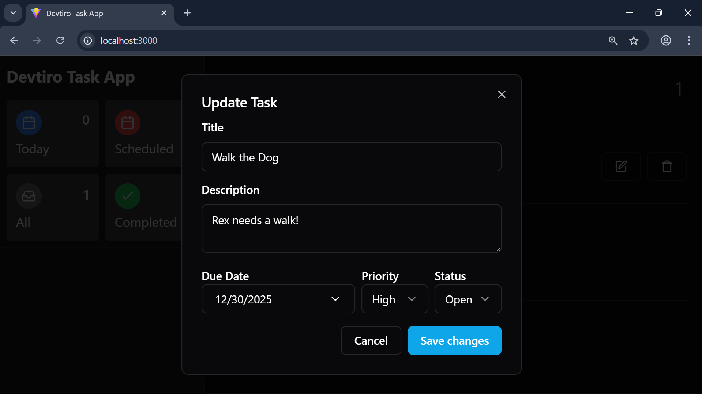

1. Click the edit button on the task you wish to edit. This brings up a dialog
   to edit the existing task.
2. You'll see all the task's existing details. Edit each field. Click the
   "Save Changes" button.
3. You'll see the updated task in the task list.

#### Complete a Task

This is the end goal of every task. Let's see how to complete a task:

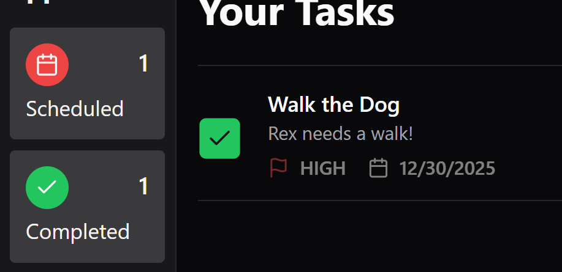

1. Click the checkbox next to the task you wish to complete.
2. The checkbox becomes ticked. Click again to re-open the task.

> [!NOTE]
> You can also update the task's status in the edit task dialog.

#### Delete a Task

Eventually you'll need to delete a task. Let's see how it's done:


1. Click the delete button next to the task you wish to delete. This brings
   up the task delete dialog.
2. Click the "Delete" button to delete the task.

Now that we understand how the app works, let's see how we'll build it.

#### Summary

- Explored each feature we're to implement.

### Domain Overview

We've seen the project brief, and we've seen the app.

What's the first step to go from one to the other?

Let's explore the app's domain.

#### What's a Domain?

When you learned Java, you certainly learned about object-oriented
programming (OOP).

When we develop software in an OOP language like Java, we write code to model
real-world things, or "objects".

Which objects we use, how we structure them, and how they interact make up our
app.

We call these objects the app's "domain". We call the process of working out the
objects in the domain "domain modelling".

Different domain modelling techniques exist, such as _noun-verb analysis_, and
_Event Storming_. Regardless of the technique you use, I consider domain
modelling more of an art than a science.

In an effort to keep things approachable for this build, I'll give you the
domain model I came up with.

Let's explore the app's domain!

#### Explore the App's Domain

You don't need a fancy technique to tell you that a task app needs an
object to model a _task_.

What's not obvious is actually what state and behaviour this task object must have to
make our app work.

For now we'll focus on state, or the fields this class needs. From this we'll
learn how to structure our data.

Modelling behaviour, or the class's methods, is less important at this stage.

Let's start with a `Task` class to model tasks in our Task App.

Let's now ask the question, "What makes a task"?

##### Title & Description

We know each task has a _title_ and optional _description_.

This is text data, so we'll use the `String` type for the `title` and
`description` fields in the `Task` class.

##### Due Date

Also mentioned in the project brief is a task's _due date_, or when the user
should complete the task by.

For our Task App we'll allow the user to select a date, but not a time.
This means we can use the Java `LocalDate` type for the `dueDate` field.

##### Task Status

What's the goal of every task? For it to go from _open_ to _completed_! This
tells us a task object can exist in at least one of two states.

We could use a boolean, where false means the task is open, and true
means the task is complete.

But what if we want to introduce more states later? Perhaps an _archived_
state, or a _cancelled_ state? Using a boolean won't make this easy!

Therefore, we'll use an enumeration, or "enum", named `TaskStatus`. It has an
`OPEN` value for a task the user has yet to do and a `COMPLETE` value for a
task the user has completed.

We'll use the `TaskStatus` type for the `status` field on our `Task` class.

##### Task Priority

Some tasks are more important than others, so they need a
priority level.

We'll use the priorities "high", "medium", and "low". As we've limited options
and we know about them ahead of time, this is another great case for an enum.

We'll use a `TaskPriority` enum, which can have the values `HIGH`, `MEDIUM`,
and `LOW`.

We'll use the `TaskPriority` type for the `priority` field on our `Task` class.

##### ID

We've captured all of the fields we need from the project brief, so what are
we missing?

Let me ask you this, "How can our app tell one task object from another?"
They may have different titles, but we need something more reliable than that.
We need a unique identifier!

We could use a numeric ID which would be unique in our database. However,
Universally Unique IDentifiers, or UUIDs, have the added benefit of being
unique everywhere. This gives us extra options for future features.

We'll use a UUID type for the `id` field on our task app.

##### Created and Updated At

It can be useful to know the time and date an object was created and last
updated.

I like to call these _audit_ fields. They give us useful information that we can use to
check everything is working as it should be.

We'll use the Java `Instant` type for both the `created` and `updated`
fields on our `Task` class, allowing us to capture date, time, and timezone
information.

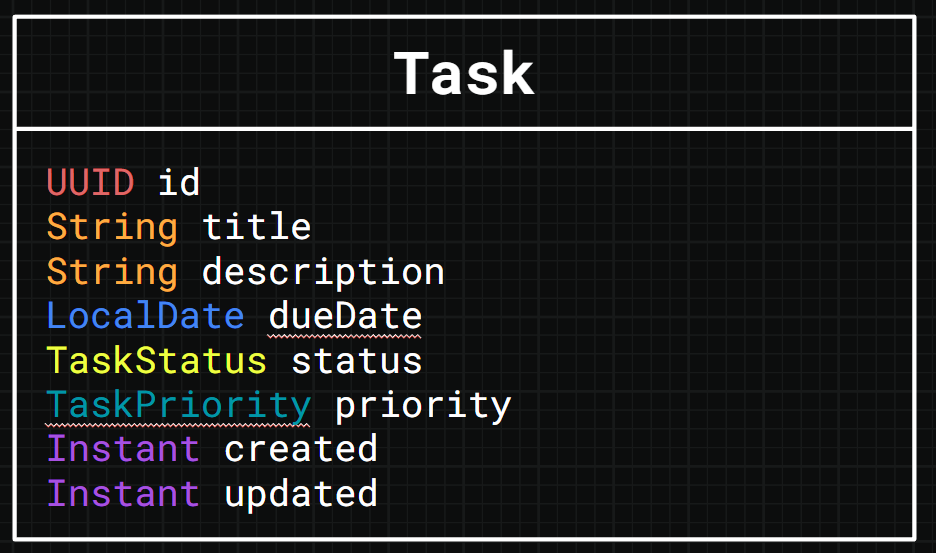

With that we've modelled the entire domain for our app, but before we get to
coding let's figure out our app's architecture.

#### Summary

- Explored the concept of an app's domain.
- Designed the domain for the Task app.

### Architecture Overview

How's the app built? What are the components? How do they fit together?

Great questions, let's answer them.

#### High-Level Architecture

This is a beginner-friendly build, and it has the architecture to match.

The app has two main components:

1. The Spring Boot app
2. The User Interface, or "UI"

The user interacts with the UI in their browser. The UI interacts with the
Spring Boot app by making calls to its REST API.

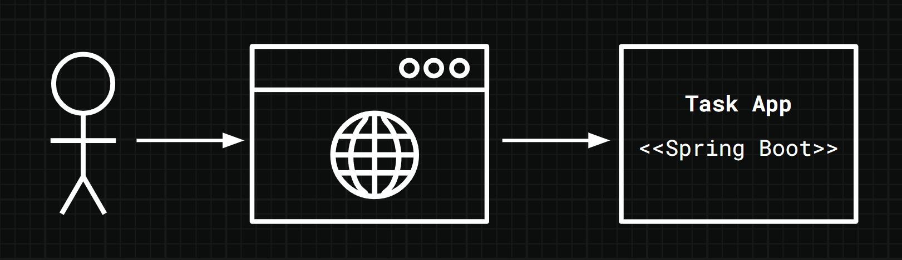

Let's explore each component in a bit more detail.

#### The Spring Boot App

The focus of this build is the Spring Boot app.

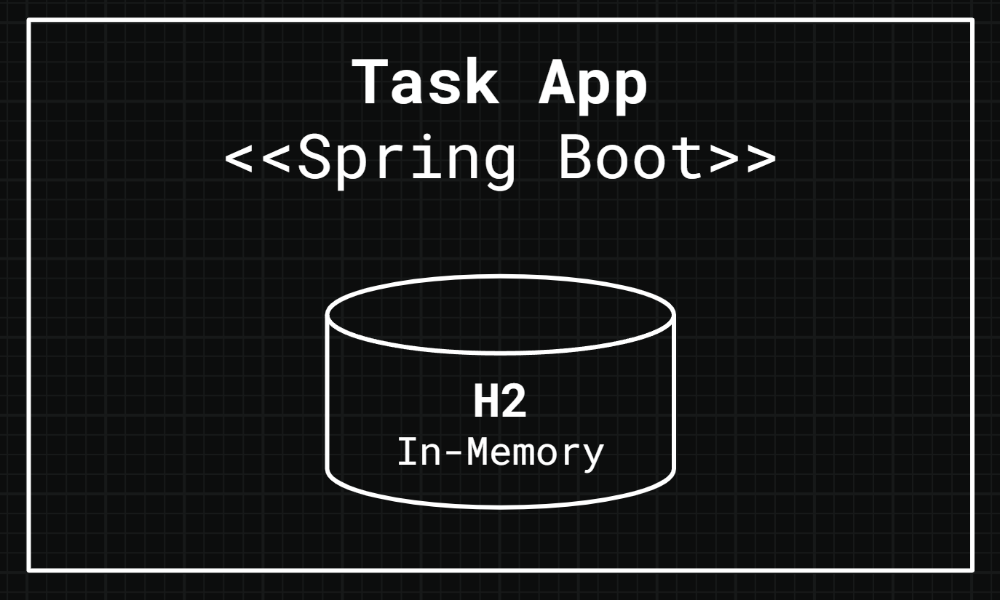

To keep things simple we'll store data in an in-memory H2 database. This
runs automatically when we run our app, reducing the infrastructure we need to
set up.

However, as the H2 database is in-memory, it means we lose our data when we
restart our Spring Boot app. A worthwhile tradeoff to make things a little
simpler for the moment.

As for running the Spring Boot app, we'll do it directly from IntelliJ.

This exposes the REST API to the User Interface.

#### The User Interface

I've built the UI for you, and packaged it up as a Docker image so it's easy
to run.

> [!NOTE]
> We'll cover how to run the UI later in the build!

Once it's running you'll interact with the UI using your browser. Clicking
buttons and filling in forms sends requests to the Spring Boot app's REST API.

This causes the app to take actions based on the business logic we've coded, and
return an appropriate response to the UI.

This is how the UI and Spring Boot app work together.

We'll explore REST API theory, and our app's REST API design in the next
lesson.

#### Summary

- Explored the architecture of the Task App, including the Spring Boot app
  component, and the UI component.

### Rest Api Overview

Our Spring Boot task app exposes a REST API, but what _is_ a REST API?

#### What's REST?

An API, or "Application Programming Interface" is a set of rules and protocols
that allows different software components to communicate with each other.

Different types of API exist. Our Spring Boot app exposes a REST API.

REST, or "Representational State Transfer" is a set of conventions built on
top of HTTP. We follow these conventions to create REST APIs.

Because we’re using HTTP, it means we’re using the request and response pattern.
A client sends a request, and expects the server to provide a timely response.

We say the UI is a "client" of the REST API exposed by our Spring Boot app, and
the Spring Boot app the "server".

It also means we’re able to use things like the HTTP verbs, headers, and
response codes.

Let’s see how these things factor into a REST API.

#### Web Resources

When designing REST APIs it all starts with _web resources._

Web resources map to your app's domain objects.

In our case we've only one domain object, the _task_, so we only have one web
resource to consider, the task.

How do we represent a web resource in a REST API?

##### Formatting Web Resources

In REST, web resources are typically represented as JSON, XML, or both. We'll
use JSON, which means we'll represent tasks in JSON format in requests and
responses exchanged with our Spring Boot app.

##### Web Resources & URLs

In REST APIs we represent each web resource with a URL.

We use the plural versions of nouns when constructing a URL, for example we may
represent the task web resource with this URL:

```text
/tasks
```

But there's more to this convention. This URL actually represents
**all** tasks in the app, the "collection" of tasks, not a _specific_ task.

To represent a specific task we need to specify the task's ID in the URL.
If we assume we're using UUIDs for task IDs, the URL for a specific task may be:

```text
/tasks/60f30f9f-2231-43b6-94d4-c8f4d44f4d83
```

Web resources are _things_, so we build URLs with nouns, and avoid verbs.
Instead we rely on another feature of HTTP to communicate behaviour,
we use the HTTP verbs.

#### HTTP Verbs

REST API clients specify an HTTP verb when they make a request.

The HTTP verbs include `GET`, `POST`, `PUT`, `PATCH`, and `DELETE`. They allow
a client to Create, Read, Update, and Delete the web resource. This is often
referred to as "CRUD" behaviour.

##### HTTP GET

We use HTTP GET to read web resources. For example, to retrieve a single task
web resource:

```text
GET /tasks/60f30f9f-2231-43b6-94d4-c8f4d44f4d83
```

This returns the task with ID `60f30f9f-2231-43b6-94d4-c8f4d44f4d83` as a JSON
object in the response body.

What if we want to get all the tasks in the app? The call would be:

```text
GET /tasks
```

We don’t need to provide anything in the request body for a `GET` request.

The HTTP `GET` verb aligns with “read”, which is the “R” in CRUD.

##### HTTP POST

A client uses the HTTP `POST` verb to create a web resource.

To do this, the client provides a representation of the web resource to create
in the request body.

An important convention with `POST` is that we must never allow the
client to specify the ID of the web resource. Instead it’s the responsibility
of the server.

For example, to create a task the URL would be `POST /tasks`, with a JSON
representation of the task to create sent in the request body.

The HTTP `POST` verb aligns with “create”, which is the “C” in CRUD.

##### HTTP PUT

A client would use the HTTP `PUT` verb to create or update a web resource.

You may be wondering how `PUT` is different from `POST`. Unlike `POST`, with
`PUT` you always specify the ID of the web resource in the URL, along with the
full representation of the task to create in the request body.

Depending on how you implement this endpoint, you could use it for creating
tasks, or updating them.

A key requirement of using `PUT` is that you must provide the full representation
of the web resource in the request body, minus any fields managed by the server
such as `created`.

If a task with the specified ID already exists, the app replaces its information
with whatever the caller provides in the request body.

The HTTP `PUT` verb aligns with "create", which is the "C" in CRUD, and also
"update", which is the "U" in CRUD.

You can also update web resources using the HTTP verb `PATCH`, but as we'll not
use it in this build, we'll not go into detail about `PATCH` here.

##### HTTP DELETE

Then there’s HTTP `DELETE`. We specify the ID of the web resource in the URL,
and use this call to delete that web resource. We don't provide anything
in the request body.

Depending on the implementation, DELETE can either remove the task from the
database, called a "hard delete", or add a flag on the task to mark it as
deleted, called a "soft delete". Soft deletes are useful for audit purposes but
mean you keep the data forever. Which you use depends on your requirements.
We're using hard deletes in this build.

#### Status Codes

A note on status codes. These are pre-defined numeric codes the server
specifies for each response that communicate the status of the operation.

As we’ll see later, the specific response code we use differs by operation,
but there is a general pattern.

Response codes in the 200 range indicate the operation was successful.

Responses in the 300 range mean the server is attempting to redirect the
client to a different URL.

Responses in the 400 range mean there's been an error, and it’s the
responsibility of the client to resolve it before trying again.

Responses in the 500 range also mean there’s been an error, but this
time it’s the responsibility of the server to resolve it.

You have some leeway when you design your REST API, but for consistency I
recommend sticking to these guidelines.

#### Versioning

It's good practice to version your REST APIs. Here's an example of a versioned
URL:

```text
GET /api/v1/tasks
```

Note the `/api/v1` prefix? Strictly speaking we only need the `v1` part to
version a REST API, but you'll often see the `/api` prefix used too.

The basic idea is this, if you introduce breaking changes to your REST API,
rather than deploy it and cause your client code to break, you can deploy a new
version and run it alongside your current version:

```text
GET /api/v2/tasks
```

We use REST API versioning in the Task App REST API, let's explore it now.

#### The Task App REST API

Now that we've an understanding of REST, let's take a look at Task App's REST
API.

It has four endpoints:

1.  Create a task.
2.  List tasks.
3.  Update a task.
4.  Delete a task.

Before we dive into the details of each endpoint, let's take a moment to
consider how we'll represent errors.

##### REST API Errors

Things go wrong all the time, our app is no exception, so it pays to handle
errors consistently.

For all errors the REST API returns a standard error format:

```json
{
  "error": "An error message"
}
```

If the client has made a bad call then the response has the
status `HTTP 400 BAD REQUEST`. If the error is on the server-side,
the response has the status `HTTP 500 INTERNAL SERVER ERROR`.

This is true for every endpoint in our app, so let's explore the first.

##### Create a Task

A call to this endpoint creates a new task.

The HTTP verb `POST` is best suited for this:

```text
POST /api/v1/tasks
```

When we call this endpoint we must provide a representation of the task to
create in the request body:

```json
{
  "title": "Walk the Dog",
  "description": "Rex needs a walk!",
  "dueDate": "2025-12-31",
  "priority": "MEDIUM"
}
```

On a success we get a response with the `HTTP 201 CREATED` status and a
representation of the created task in the response body:

```json
{
  "id": "33b24989-746a-4b98-aa21-6e5952a4d66b",
  "title": "Walk the Dog",
  "description": "Rex needs a walk!",
  "dueDate": "2025-12-31",
  "priority": "MEDIUM",
  "status": "OPEN"
}
```

> [!NOTE]
> See that the response body has an `id` field and `status` field?
> The app sets these when it creates the task, the UI doesn't provide them.

##### List Tasks

Listing all tasks in the app is a read operation, so we use HTTP `GET`:

```text
GET /api/v1/tasks
```

We don't provide anything in the request body for this request.

On a success the app returns a list of tasks in the response body, along with
the status `HTTP 200 OK`:

```json
[
  {
    "id": "3fa85f64-5717-4562-b3fc-2c963f66afa6",
    "title": "Task A",
    "description": "Task A description.",
    "dueDate": "2025-11-01",
    "priority": "MEDIUM",
    "status": "OPEN"
  },
  {
    "id": "44ddc656-4bfb-4c83-b0fa-239e863ad438",
    "title": "TASK B",
    "description": "Task B description.",
    "dueDate": "2025-11-02",
    "priority": "LOW",
    "status": "COMPLETED"
  }
]
```

##### Update a Task

Of the HTTP verbs used to update web resources, our API uses HTTP `PUT`:

```text
PUT /api/v1/tasks/3fa85f64-5717-4562-b3fc-2c963f66afa6
```

This means we specify the task's ID in the URL, and provide a full
representation of the task to be updated in the request body:

```json
{
  "title": "Walk the Fish",
  "description": "Frank needs his exercise!",
  "dueDate": "2026-01-10",
  "priority": "HIGH",
  "status": "COMPLETED"
}
```

Well, almost a full representation. We'll omit the `id` field in the update
request as we're already providing it in the URL.

Also note we don't provide the `created` or `updated` fields, as the server
manages these fields. We can't update them manually!

The update endpoint returns a `HTTP 200 OK` on a success.

##### Delete a Task

Finally we've the delete task endpoint, which uses the HTTP verb `DELETE`:

```text
DELETE /api/v1/tasks/3fa85f64-5717-4562-b3fc-2c963f66afa6
```

We don't provide anything in the request body, and the app returns nothing in
the response body.

In fact, regardless of whether the task specified in the URL existed in the first
place, the app always returns a `HTTP 204 NO CONTENT`.

This may seem strange, but think of it this way, regardless of whether the task
existed in the first place, it definitely won't after the call!

Believe it or not, this is the recommended approach for REST API delete
endpoints.

Now that we've designed the app's REST API, let's cover the Spring Boot theory
we need to start coding!

#### Summary

- Explored the concept of REST APIs.
- Established the Task App's REST API.

## Project Setup

### Start New Project

Let's start a new project!

#### Spring Initializr

The most effective way I know to start a new Spring Boot project is by using the
Spring Initializr.

The Spring Initializr is a website where you specify the configuration you
want to use for your new Spring Boot project, and it generates a skeleton
project for you to build on.

To access the Spring Initializr, head to
[https://start.spring.io/](https://start.spring.io/).

##### Project & Language Configuration

The first set of configuration we must specify is the project and language
configuration.

Here we answer the question, "Which tool and which programming language do we
want to use?"

In this build we're writing Java code with Apache Maven as our build tool,
so be sure to select "Maven" under the "Project" heading and "Java" under the
"Language" heading.

##### Spring Boot Version

Now for the Spring Boot version.

This is important, as different versions of Spring Boot can work in subtly
different ways.

This build uses the `4.0.x` version of Spring Boot, so make sure to select the
latest version of the `4.0.x` releases. For example `4.0.0`, `4.0.1`, `4.0.2`
etc.

> [!CAUTION]
> If you select a different version of Spring Boot, the steps in this build may
> not work for you.
>
> Please use the versions specified in the build wherever possible.

##### Project Identity

Now for the project metadata. This contains configuration on how we identify
our project, how we configure it, how we run it, and which version of Java our
app uses.

Let's start with the configuration to identify our project:

- **Group:** `com.devtiro`
- **Artifact:** `task`
- **Name:** `Devtiro Task App`
- **Description:** `A task tracking application.`
- **Package name:** `com.devtiro.task`

##### Packaging

Now for packaging, we need to select "Jar", and **not** "War". Selecting Jar
gives us the option of a project with a bundled app container. This means we
can just run the app without setting up anything extra.

Selecting War means you would need to deploy your built app to a separate app
container to run it. That's an additional step that doesn't provide value to
our build, so we're not going to do it.

##### Properties vs YAML

We'll select "Properties" for the configuration for this build. Properties have
the benefit of being simpler to work with, but less flexible than YAML. This
makes properties the best option for this build.

##### Java Version

At the time of writing, the latest version of Java is version `25`, so of the
options for Java version, we'll select `25`.

> [!CAUTION]
> If you select a different version of Java, the steps in this build may
> not work for you.
>
> Please use the versions specified in the build wherever possible.

##### Dependencies

One of the big benefits of using Spring Boot is the extensive ecosystem of
dependencies you get access to.

Each dependency solves a specific problem. Here are the ones we need
for this build:

- **Spring Web** - We need this to build our app's REST API.
- **Validation** - We need this to validate requests made to our app's REST API.
- **Spring Data JPA** - We need this to interact with a database using
  Java objects, rather than writing SQL.
- **H2 Database** - We need this to run the in-memory database we use for this
  build.

> [!CAUTION]
> Be sure to select "Spring Web" and not "Spring Reactive Web"!

That's it! Now click the "GENERATE" button to download your skeleton
Spring Boot project.

#### Open the Project

With the project downloaded, we must open it in IntelliJ IDEA to start
development.

The downloaded file is a zip file, so we must unzip it somewhere on our
machine that makes sense to us.

With that done, we open IntelliJ IDEA and follow these steps:

1.  Select "File" -> "Open" in the toolbar at the top of the screen.
2.  Select the project's unzipped folder in the file explorer.
3.  Click "OK".

This opens the project in IntelliJ, ready for us to start development!

#### Summary

- Used the Spring Initializr to create a new project.
- Opened the new project in IntelliJ IDEA.

### Run The Ui

Now we've created a new Spring Boot project, let's run the user interface.

#### Docker Compose

To run the UI we'll use Docker Compose. This way we can build the UI Docker
image and run it with all the configuration it needs to communicate with our
Spring Boot app.

The UI source code is in the `frontend` directory of this repository, and Docker
Compose will build it into an image for you. You don't need to know React, or
install Node, to run it.

You need Docker installed on your machine to run the UI. Once installed you
can run the UI from a single file.

If you haven't installed Docker yet, you can find information on how to do this
on the [Docker website](https://www.docker.com/).

To get started, let's create a file named `docker-compose.yml` in the root of our
project. Then we'll place the following content into the file:

```yaml
# The name of the Docker Compose environment.
name: devtiro-build-task-app
services:
  # The UI service.
  ui:
    # Build the UI image from the source in the frontend directory.
    build: ./frontend
    ports:
      # Make the UI available on http://localhost:3000
      - '3000:3000'
    # Tell the UI how to find your Spring Boot app.
    environment:
      - BACKEND_HOST=host.docker.internal
      - BACKEND_PORT=8080
    # For Linux compatibility
    extra_hosts:
      - 'host.docker.internal:host-gateway'
```

The first time you run this, Docker will build the UI image, which takes a
minute or two. After that it's cached, so it starts quickly.

#### Run the User Interface

To run the UI, open up a terminal or command prompt and navigate to the same
directory as your `docker-compose.yml` file.

Once you're there, run the following:

```shell
docker-compose up
```

With that done, head over to `http://localhost:3000` in your browser to see
the UI!

Now that we have everything ready to start developing, let's implement our app's
domain.

#### Summary

- Created a `docker-compose.yml` file.
- Ran the UI.

## Domain

### Create Task Enums

Let's start coding our app's domain classes.

But we can't jump right to coding the `Task` class. First, we need to create a
couple of enums.

#### Create the Task Status Enum

When a user creates a new task we say it's _open_.

When a user performs the task we say it's _complete_.

Let's create an enum to capture this.

To keep things organised we'll create a dedicated package for our domain
classes and a nested package for our entities.

This separates the classes we use to interact with the database from
classes that don't.

Let's create the package `com.devtiro.task.domain.entity` for the classes we
use to interact with the database.

We'll create the `TaskStatus` enum in this package:

```java
/** Models the status of a Task; either open or complete. */
public enum TaskStatus {

  /** The task is open and is yet to be completed. */
  OPEN,

  /** The task has been completed. */
  COMPLETE

}
```

#### Create the Task Priority Enum

Tasks also have a priority, which can be high, medium, and low.

Let's model this with a new `TaskPriority` enum, creating it in the same
package:

```java
/** Models the priority of a task, how important is it? */
public enum TaskPriority {

  /** The highest priority, the most important to complete. */
  HIGH,

  /** The default priority, a task of average importance. */
  MEDIUM,

  /** The lowest priority, the least important to complete. */
  LOW

}
```

Now that we've created the `TaskStatus` and `TaskPriority` enums, we can
create the `Task` class.

#### Summary

- Created the `TaskStatus` enum to model task status.
- Created the `TaskPriority` enum to model task priority.

### Create Task Entity

Now to create the `Task` entity!

#### Define the Instance Variables

Let's create our new `Task` class in the package we created in the last lesson,
`com.devtiro.task.domain.entity`.

We'll create this class in steps, starting with the instance variables:

```java
/** Models a task the user plans to do. */
@Entity
@Table(name = "tasks")
public class Task {

  /** The task's unique identifier. Generated automatically by JPA. */
  @Id
  @GeneratedValue(strategy = GenerationType.UUID)
  @Column(name = "id", updatable = false, nullable = false)
  private UUID id;

  /** The title of the task. A maximum length of 255 characters. */
  @Column(name = "title", nullable = false)
  private String title;

  /** A description of the task. A maximum length of 1000 characters. */
  @Column(name = "description", length = 1000)
  private String description;

  /** The date the task is due. */
  @Column(name = "due_date")
  private LocalDate dueDate;

  /** The status of the task: is it open or complete? */
  @Enumerated(EnumType.STRING)
  @Column(name = "status", nullable = false)
  private TaskStatus status;

  /** The task's priority: how important is the task - high, medium, or low? */
  @Enumerated(EnumType.STRING)
  @Column(name = "priority", nullable = false)
  private TaskPriority priority;

  /** The date and time the task was created. */
  @Column(name = "created", nullable = false, updatable = false)
  private Instant created;

  /** The date and time the task was last updated. */
  @Column(name = "updated", nullable = false)
  private Instant updated;

}
```

We use the `@Entity` annotation to mark this as a JPA entity. This class maps
to a database table.

The `@Table(name = "tasks")` annotation specifies the name of the table
generated by Hibernate DDL Auto.

The `@Enumerated(EnumType.STRING)` annotation ensures we store enums as strings
in the database, rather than numbers, which is the default. This way they're
easier to read and our business logic won't get confused if the numeric values
change at some point.

> [!NOTE]
> Hibernate is the technology our app uses to allow us to interact with the
> database using Java objects. "Hibernate DDL Auto" is the feature which
> automatically creates database tables from our entities.

In this app, we're using the default configuration provided by Spring Boot,
so when we start our app for the first time, the table is automatically created
in the database.

Now we've created the instance variables, let's move on to the constructors.

#### Generate Constructors

We need two constructors to work with Hibernate. One with no arguments, and one
with arguments for all the class's instance variables.

We'll use IntelliJ's code generation feature to create this code for us.

> [!NOTE]
> We're not talking about AI code generation here, this feature is a bit simpler
> than that, but incredibly useful!

##### Generate a No-Argument Constructor

To generate a constructor with no arguments:

1. Right click in the edit window.
2. Select "Generate".
3. Select "Constructor".
4. Ensure **no** fields are selected.
5. Click "OK".

##### Generate an All-Argument Constructor

To generate a constructor with all arguments:

1. Right click in the edit window.
2. Select "Generate".
3. Select "Constructor".
4. Ensure **all** fields are selected.
5. Click "OK".

> [!NOTE]
> We can use tools like Project Lombok to generate these constructors for us
> by using Java annotations. We'll not use Lombok in this project to keep
> things more approachable, but it's a great tool to know!

#### Generate Getters and Setters

Now for the getters and setters. Again, we'll use IntelliJ's code
generation feature to write this code for us. The IntelliJ default template is
absolutely fine for our needs.

1. Right click in the edit window.
2. Select "Generate" from the menu.
3. Select "Getters & Setters".
4. Select all the instance variables in the list.
5. Click the "OK" button.

#### Generate Equals and Hashcode

Different equals and hash code strategies exist, with each implementation
offering its own benefits and drawbacks.

A deep dive into the pros and cons of each strategy is outside the scope
of this build. The short version is our strategy uses only the entity's ID field
for its equals and hash code implementation. This approach works perfectly for
this build.

1. Right click in the edit window.
2. Select "Generate" from the menu.
3. Select "Equals and Hashcode".
4. Select the template "IntelliJ Default".
5. Select the `getClass` comparison expression.
6. Select **only** the `id` field.
7. Accept the defaults for the remaining screens. Having `id` nullable is fine.
8. Click the "OK" button.

#### Generate toString

Finally, let's generate a helpful `toString` method.

1. Right click in the edit window.
2. Select "Generate" from the menu.
3. Select "toString".
4. Select all the instance variables in the list.
5. Click the "OK" button.

With this, our `Task` entity class is now ready to use!

#### Summary

- Created the `Task` entity.

### Define Task Repository

An entity isn't much use by itself, so let's create a repository.

This way we can use the `Task` entity to interact with the database!

#### Declare the Task Repository

Let's create a dedicated package for our repository,
`com.devtiro.task.repository`. In a typical project you often have multiple
repositories, so this convention keeps things organised.

Now let's create the task repository. This is an interface, which we'll call
`TaskRepository`:

```java
/** Repository for handling tasks. */
@Repository
public interface TaskRepository extends JpaRepository<Task, UUID> {}
```

That's it! We don't need to create an implementation for this interface, because
the framework does it for us! Better yet, extending `JpaRepository` gives us
all the functionality we need for this build.

Now let's move on to the service layer.

#### Summary

- Defined the `TaskRepository` interface.

## Create Task Feature

### Service Layer Objects

Let's create a class to represent the create task request.

#### Create the Create Task Request Class

We know we need certain information to create a new task:

- Title
- Description (optional)
- Due date (optional)
- Priority

Let's create a class to capture all of this information.

As this class is just a data structure, we'll use a Java record.

Let's create the `CreateTaskRequest` record in the `com.devtiro.task.domain`
package:

```java
/**
 * Models a request to create a new task.
 * This class is owned by the service layer.
 *
 * @param title The title of the task to create.
 * @param description The description of the task to create.
 * @param dueDate The date the task is due. Can be null.
 * @param priority The priority of the task.
 */
public record CreateTaskRequest(
    String title,
    String description,
    LocalDate dueDate,
    TaskPriority priority
) {}
```

Now that we have a class to model the create task request, let's move on to
the business logic in our service layer.

#### Summary

- Created the `CreateTaskRequest` class.

### Service Layer

Let's write the business logic to create a new task.

#### Define the Create Task Method

To paraphrase Uncle Bob, we should write software components to depend on
_abstractions_, not _concretions_.

We're not just going to create a new class and start to code the create task
method. Not yet.

Instead, we first define the create task behaviour in an interface, and
_then_ we implement it.

Let's create a new package for our services, `com.devtiro.task.service`.

Now to define the create task functionality in an interface, let's call
it `TaskService`:

```java
/** Service for handling Tasks. */
public interface TaskService {

  /**
   * Creates a new task.
   *
   * @param request The request object used to create the task.
   * @return The created task.
   */
  Task createTask(CreateTaskRequest request);

}
```

Note we're using the `CreateTaskRequest` class we created in the last
lesson as the method's only argument. This means the method has everything it
needs to create a new task.

Also note the method returns a `Task` entity. This is the task created as
a result of the method's logic.

> [!NOTE]
> To decouple this method further, we could return a dedicated object
> owned by the service layer, perhaps a `CreateTaskResponse` object.
> We're returning the `Task` entity to reduce the number of classes we need to
> create in an effort to keep the build more approachable.

Now that we've defined the create task method, let's implement it!

#### Implement the Create Task Method

Although not mandatory, I believe it's useful to separate interface
implementations into their own subpackage. This keeps the codebase just a bit
more organised.

By convention, this package is often called `impl`, which is short for
"implementation". It's nested inside the same package as the interfaces.

Let's create our own `impl` package, `com.devtiro.task.service.impl`.

Inside this new package we create the class that implements `TaskService`,
which by convention we'll call `TaskServiceImpl`:

```java
/** Service for handling Tasks. */
@Service
public class TaskServiceImpl implements TaskService {

  /** The task repository. */
  private final TaskRepository taskRepository;

  /**
   * Constructs a new TaskServiceImpl using the provided values.
   *
   * @param taskRepository The TaskRepository dependency.
   */
  public TaskServiceImpl(TaskRepository taskRepository) {
    this.taskRepository = taskRepository;
  }

  @Override
  public Task createTask(CreateTaskRequest request) {

    // Get the time, date, and timezone right now.
    Instant now = Instant.now();

    // Create a new Task entity.
    Task newTask =
      new Task(
        null, // Hibernate to generate an ID for us.
        request.title(),
        request.description(),
        request.dueDate(),
        TaskStatus.OPEN, // Default to an open status.
        request.priority(),
        now,
        now);

    // Save the Task, returning the saved Task to the caller.
    return taskRepository.save(newTask);
  }

}
```

The `@Service` annotation is a specialised version of `@Component`. We
place it on the class to mark it as a bean.

We now have the business logic to create a new task. Let's now move on to the
presentation layer.

#### Summary

- Defined the `TaskService` interface.
- Defined and implemented the `createTask` method.

### Dto Mappers

We've implemented the create task method in the service layer, but how do we
call it from the REST API?

The first step is to define the REST API's request and response.

#### Create the Create Task Request DTO

Now we get to see the Data Transfer Object (DTO) pattern in action.

Let's create these presentation-layer classes to represent the create task
request and response bodies.

First, let's create a new package for our DTO classes,
`com.devtiro.task.domain.dto`.

In the new package, we'll create the DTO class to represent the request body.

Let's create `CreateTaskRequestDto`:

```java
/**
 * A DTO modelling a request to create a new task.
 * This class is owned by the presentation layer.
 *
 * @param title The title of the task to create.
 * @param description The description of the task to create.
 * @param dueDate The date and time the task is due.
 * @param priority The priority of the task.
 */
public record CreateTaskRequestDto(
  @NotBlank(message = ERROR_MESSAGE_TITLE_LENGTH)
  @Length(max = 255, message = ERROR_MESSAGE_TITLE_LENGTH)
  String title,

  @Length(max = 1000, message = ERROR_MESSAGE_DESCRIPTION_LENGTH)
  @Nullable
  String description,

  @FutureOrPresent(message = ERROR_MESSAGE_DUE_DATE_FUTURE)
  @Nullable
  LocalDate dueDate,

  @NotNull(message = ERROR_MESSAGE_PRIORITY)
  TaskPriority priority) {

  private static final String ERROR_MESSAGE_TITLE_LENGTH =
    "Title must be between 1 and 255 characters";
  private static final String ERROR_MESSAGE_DESCRIPTION_LENGTH =
    "Description must be less than 1000 characters";
  private static final String ERROR_MESSAGE_DUE_DATE_FUTURE =
    "Due date must be in the future";
  private static final String ERROR_MESSAGE_PRIORITY =
    "Task priority must be provided";

}
```

We're making good use of validation annotations in the `CreateTaskRequestDto`
class. These annotations ensure the values in these variables are exactly what
we expect them to be.

We'll see how to activate these annotations when we implement the task
controller. For now, let's move on to the task response DTO.

#### Create the Create Task Response DTO

Although it may be better practice to create a DTO _just_ for the create task
response, we're going to create a generic `TaskDto` class.

We're going to return task data from a few REST API endpoints. By re-using
the same DTO, we have fewer classes to create and manage. Therefore, the build
is more approachable, but at the cost of added coupling. A worthwhile trade-off
for this build.

Let's create the `TaskDto` class in `com.devtiro.task.domain.dto`:

```java
/**
 * A DTO representing a task. This class is owned by the presentation layer.
 *
 * @param id The ID of the task.
 * @param title The title of the task.
 * @param description The description of the task.
 * @param dueDate The date the task is due.
 * @param priority The priority of the task.
 * @param status The status of the task.
 */
public record TaskDto(
    UUID id,
    String title,
    String description,
    LocalDate dueDate,
    TaskPriority priority,
    TaskStatus status) {}
```

Note that there are no validation annotations on the `TaskDto` class. This is
because the `TaskDto` class is never a request body, it's always a response
body. There's little value in validating a response, so there's no need
to add validation annotations to the `TaskDto` class.

But how do we go from a `Task` class to a `TaskDto`?

#### Mapper

Let's create a dedicated package for our mappers, `com.devtiro.task.mapper`.

Just like our services, we'll define an interface first and then implement it.

Let's create the `TaskMapper` interface in our new package:

```java
/** Mapper handling Tasks. */
public interface TaskMapper {

  CreateTaskRequest fromDto(CreateTaskRequestDto dto);

  TaskDto toDto(Task task);

}
```

We've defined two methods here, one to map from a `CreateTaskRequestDto` to a
`CreateTaskRequest`, and the other to map from `Task` to `TaskDto`.

Now let's implement the mapper. We'll create an impl package
`com.devtiro.task.mapper.impl` and the class `TaskMapperImpl`:

```java
@Component
public class TaskMapperImpl implements TaskMapper {

  @Override
  public CreateTaskRequest fromDto(CreateTaskRequestDto dto) {
    return new CreateTaskRequest(
        dto.title(),
        dto.description(),
        dto.dueDate(),
        dto.priority()
    );
  }

  @Override
  public TaskDto toDto(Task task) {
    if (null == task) {
      return null;
    }
    return new TaskDto(
        task.getId(),
        task.getTitle(),
        task.getDescription(),
        task.getDueDate(),
        task.getPriority(),
        task.getStatus());
  }

}
```

> [!NOTE]
> We can use tools like MapStruct to generate these mappers for us, but we'll
> avoid them for this build to keep things approachable.

We now have a mapper. Let's use it to implement the task controller class.

#### Summary

- Created the `CreateTaskRequestDto` class.
- Created the `TaskDto` class.
- Defined the `TaskMapper` interface.
- Implemented the `TaskMapper` interface.

### Controller

With the domain, persistence, and service layers done, let's implement the
create task feature in the presentation layer.

#### Create Task Controller

In a Spring Boot app, we build REST APIs using REST API controller classes.

Let's create a dedicated package to store these controller classes,
`com.devtiro.task.controller`.

Now to create the `TaskController` class in this package:

```java
/** REST API controller for tasks. */
@RestController
@RequestMapping(path = "/api/v1/tasks")
public class TaskController {

  /** The task service from the service layer. */
  private final TaskService taskService;

 /** The task mapper. */
  private final TaskMapper taskMapper;

  /**
   * Constructs a new TaskController.
   *
   * @param taskService The TaskService dependency.
   * @param taskMapper The TaskMapper dependency.
   */
  public TaskController(TaskService taskService, TaskMapper taskMapper) {
    this.taskService = taskService;
    this.taskMapper = taskMapper;
  }

  // TODO: Create task endpoint method.

}
```

The `@RestController` annotation works in a similar way to `@Component`,
marking the class as a bean. Therefore, the framework injects dependencies
declared in the `TaskController` class constructor.

> [!NOTE]
> Despite being a bean, we almost never declare a controller class as a
> dependency. Instead, the framework searches out REST API controller classes
> on startup, exposing the corresponding REST API to clients.

#### Create Task Endpoint

Now to implement the create task endpoint, which is a special kind of method
on the `TaskController` class.

```java
  /**
   * Creates a new task.
   *
   * @param createTaskRequestDto The request DTO used to create a task.
   * @return A representation of the created task and an HTTP 201 CREATED.
   */
  @PostMapping
  public ResponseEntity<TaskDto> createTask(
      @Valid @RequestBody CreateTaskRequestDto createTaskRequestDto) {

    // Map the CreateTaskRequestDto to a CreateTaskRequest.
    CreateTaskRequest taskToCreate = taskMapper.fromDto(
        createTaskRequestDto
    );

    // Call createTask on the TaskService,
    // passing the CreateTaskRequest as an argument.
    Task createdTask = taskService.createTask(taskToCreate);

    // Map the newly created Task object into a TaskDto.
    TaskDto createdTaskDto = taskMapper.toDto(createdTask);

    // Return the TaskDto object to the caller with an HTTP 201 CREATED.
    return new ResponseEntity<>(createdTaskDto, HttpStatus.CREATED);

  }
```

The `@PostMapping` annotation specifies the endpoint uses the HTTP
`POST` verb.

The `ResponseEntity` response type is interesting! Through this object we
can control aspects of the response, like the response code and response body.
In this case we declare the response body as the type `TaskDto`.

The `@RequestBody` annotation tells the framework to expect a request body of
the type `CreateTaskRequestDto`. The `@Valid` annotation activates the
validation annotation we added to this DTO.

What happens when the request body is invalid? The framework throws an
exception. Let's handle this exception.

#### Summary

- Created the `TaskController` class.
- Implemented the `createTask` method.

### Exception Handling

We're almost ready to try out our new create task endpoint.

But first we need to handle validation exceptions.

#### Create the Error DTO

As a reminder, our REST API represents all errors in this standard format:

```json
{
  "error": "An error message"
}
```

Let's create a DTO class to represent this format.

In `com.devtiro.task.domain.dto`, let's create the `ErrorResponseDto` class:

```java
/**
 * Models the standard error format used by the REST API.
 *
 * @param error The error message.
 */
public record ErrorResponseDto(String error) {}
```

This simple record has only a single field, `error`, but that's all it needs!

Now we can handle exceptions, returning an `ErrorResponseDto` to the caller.

#### Create the Global Exception Handler

There's a common pattern for handling exceptions in a Spring Boot REST API.
It's called the "global exception handler".

This class contains logic to handle specific exceptions, returning the
appropriate REST API response.

Let's create the `GlobalExceptionHandler` class in the
`com.devtiro.task.controller` package:

```java
/**
 * Handles exceptions thrown by the service layer,
 * returning errors in a standardised format.
 * */
@RestControllerAdvice
public class GlobalExceptionHandler {

 // TODO: Handle validation exception.

}
```

The `@RestControllerAdvice` annotation tells the framework to look here for
exception handling methods.

Let's add one to handle validation exceptions.

#### Handle Validation Exceptions

We can add validation annotations to a DTO and use the `@Valid` annotation in
our REST API controller to "activate" them.

When a caller provides an invalid request body, the framework throws a
`MethodArgumentNotValidException`.

It's our responsibility to handle this exception. Here's how we do it:

```java
  /**
   * Handles MethodArgumentNotValidException,
   * returning a standardised error response and an HTTP 400 BAD REQUEST.
   * This exception is thrown when a @Valid validation fails.
   *
   * @param ex the exception.
   * @return A standardised error response.
   */
  @ExceptionHandler(MethodArgumentNotValidException.class)
  public ResponseEntity<ErrorResponseDto> handleValidationException(
      MethodArgumentNotValidException ex) {

    // Get the first validation error message
    String errorMessage =
        ex.getBindingResult().getFieldErrors().stream()
            .findFirst()
            .map(DefaultMessageSourceResolvable::getDefaultMessage)
            .orElse("Validation failed.");

    // Create an ErrorResponseDto using the error message.
    ErrorResponseDto errorDto = new ErrorResponseDto(errorMessage);

    // Return the ErrorResponseDto in the response body
    //  with an HTTP 400 BAD REQUEST.
    return new ResponseEntity<>(errorDto, HttpStatus.BAD_REQUEST);

  }
```

You can think of the `@ExceptionHandler` annotation as the counterpart to the
`@RestControllerAdvice` annotation. It's the `@ExceptionHandler` annotated
method that tells the framework how to handle a specific type of exception.

In this case, we extract the first validation message from the
`MethodArgumentNotValidException`, returning it as an `ErrorResponseDto`, with a
`HTTP 400 BAD REQUEST`.

Now that we've handled validation exceptions, let's try creating a new task in
the user interface!

#### Summary

- Created the `ErrorResponseDto` class.
- Created the `GlobalExceptionHandler` class.
- Handled the `MethodArgumentNotValidException`.

### Ui Testing

Let's try out the create task feature in the UI.

#### Create a Task

To get started, let's ensure the UI is running in Docker, then head over to `http://localhost:3000` in our browser.

> [!NOTE]
> The network panel in your browser's developer tools is one of the best places
> to look when figuring out if your REST API requests are working as expected.

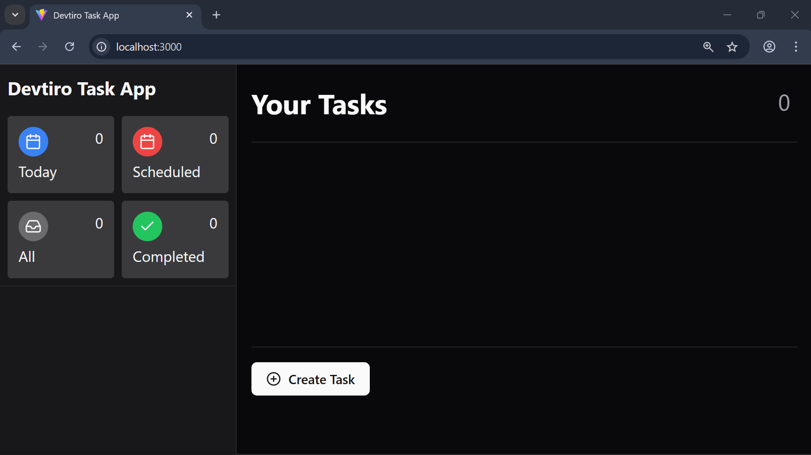

1. Click the "Create Task" button in the bottom-left of the page. This brings up
   a dialog with a form to create a new task.

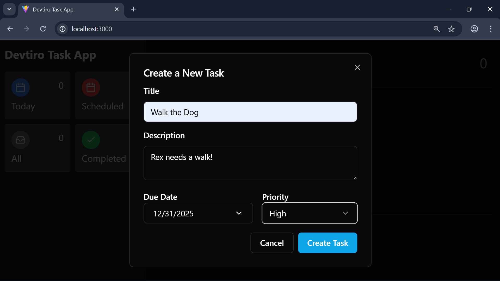

2. Enter a title, optional description, optional due date, and select a
   priority. Click the "Create Task" button to create the task.

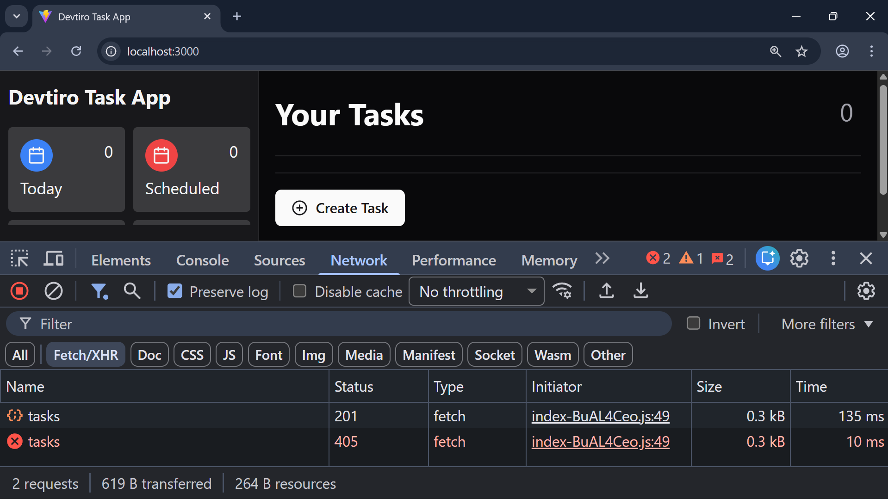

3. You'll see `HTTP 201 CREATED` returned on the create task call.

But wait, why can't we see the task we created on the UI? Well, that's because
we haven't implemented the list tasks endpoint yet.

Let's code this next.

#### Summary

- Created a task using the UI.

## List Task Feature

### Service Layer

Now we'll implement listing tasks. The good news is that there are no new
classes to create!

However, we do need to update the `TaskService` interface.

#### Update the Task Service Interface

The `TaskService` interface already has the `createTask` method we added earlier.

We're now going to add a second one to define listing tasks.

Let's add the `listTasks` method to the `TaskService` interface:

```java
  /**
   * Lists all tasks.
   *
   * @return A list of all tasks.
   */
  List<Task> listTasks();
```

This new method doesn't require any arguments. It simply returns a list of all
task entities in the database.

> [!NOTE]
> Returning all entities in the database may not always be ideal. If there are a
> lot of entities then we could see some serious performance problems!
> _Pagination_ is one solution to this challenge, but we use a list here to keep
> this build approachable.

Now let's implement the new method.

#### Implement the List Tasks Method

Let's head over to `TaskServiceImpl` and implement our new `listTasks` method:

```java
  @Override
  public List<Task> listTasks() {
    return taskRepository.findAll(Sort.by(Direction.ASC, "created"));
  }
```

We're relying on the task repository to do a lot of the hard work in this method!

Although we could simply call `findAll` without arguments to get a list of tasks,
we're asking for the results to be sorted oldest to newest.

That's the service layer complete, let's move on to the list tasks endpoint in
the presentation layer.

#### Summary

1. Added the `listTasks` method to the `TaskService` interface.
2. Implemented the `listTasks` method.

### List Task Endpoint

Let's add a list tasks endpoint to our REST API!

#### Implement the List Task Endpoint

The list tasks endpoint is simpler than the create tasks endpoint:

```java
  /**
   * Lists all tasks with an HTTP 200 OK.
   *
   * @return The list of tasks.
   */
  @GetMapping
  public ResponseEntity<List<TaskDto>> listTasks() {

    // Call the listTasks method on the TaskService to get a list of tasks.
    List<Task> tasks = taskService.listTasks();

    // Map the list of Task objects to a list of TaskDto objects.
    List<TaskDto> taskDtoList = tasks.stream()
        .map(taskMapper::toDto)
        .toList();

    // Return the list of TaskDto objects with an HTTP 200 OK.
    return ResponseEntity.ok(taskDtoList);

  }
```

We use `@GetMapping` as this endpoint uses HTTP `GET`, and as we're using
HTTP `GET` we don't expect a request body.

There we have it, the list tasks endpoint is now ready to test in the UI!

#### Summary

- Implemented the `listTasks` method on the `TaskController`.

### Ui Testing

Now we've coded the list tasks endpoint, let's test creating a task again.

Let's head over to `http://localhost:3000` in our browser.

#### List Tasks


1. Click the "Create Task" button in the bottom-left of the page. This brings up
   a dialog with a form to create a new task.


2. Enter a title, optional description, optional due date, and select a
   priority. Click the "Create Task" button to create the task.


3. You'll see a new task in the task list.

It looks like our create task and list task endpoints are working correctly!

Let's move on to coding the task update feature.

#### Summary

- Listed tasks using the UI.

## Update Task Feature

### Service Layer Objects

The create task method uses an object to capture all the information needed
to create a task.

Let's do the same for the task update feature. Let's create the update task
request class.

#### Create the Update Task Request Class

Let's create the `UpdateTaskRequest` in `com.devtiro.task.domain`:

```java
/**
 * Models a request to update an existing task.
 * This class is owned by the service layer.
 *
 * @param title The title of the task.
 * @param description The description of the task.
 * @param dueDate The date the task is due.
 * @param status The status of the task. Can be null.
 * @param priority The priority of the task.
 */
public record UpdateTaskRequest(
    String title,
    String description,
    LocalDate dueDate,
    TaskStatus status,
    TaskPriority priority) {}
```

This class differs from the `CreateTaskRequest` class in one important way.
This class has a `status` field. This is how the user is able to update
the status of their task.

With the class created, we're almost ready to start the business logic, but
first we must create a custom exception.

#### Summary

- Created the `UpdateTaskRequest` class.

### Task Not Found Exception

What should we do when a user tries to update a task that doesn't exist?

This is certainly an error case, so let's create a custom exception to model
this error.

#### Create the Task Not Found Exception

To keep things organised we'll create a dedicated package for our exceptions,
`com.devtiro.task.exception`.

In this new package we'll create the `TaskNotFoundException`:

```java
/** Thrown when a task is not found. */
public class TaskNotFoundException extends RuntimeException {

  /** The error message template. */
  public static final String ERROR_MESSAGE =
    "Task with ID '%s' does not exist";

  /** The ID of the task that was not found. */
  private final UUID id;

  /**
   * Constructs a new TaskNotFoundException using
   * the ID of the task not found.
   *
   * @param id The ID of the task not found.
   */
  public TaskNotFoundException(UUID id) {
    super(String.format(ERROR_MESSAGE, id));
    this.id = id;
  }

  public UUID getId() {
    return id;
  }

}
```

This exception has a single constructor that expects the ID of the task that
wasn't found. It uses this ID to create a custom error message that it passes
to the superclass constructor.

This way we can capture the ID and get a helpful error message in the
stack trace.

Now we can move on to the business logic.

#### Summary

- Created the `TaskNotFoundException` class.

### Service Layer

Let's implement the business logic to update a task.

#### Update the Task Service

We'll start by updating the `TaskService` interface.

We'll define a new method to update a task, using the `UpdateTaskRequest`
object we just created:

```java
  /**
   * Updates the specified task.
   *
   * @param taskId The ID of the task to update.
   * @param request The request object used to update the task.
   * @return The updated task.
   */
  Task updateTask(UUID taskId, UpdateTaskRequest request);
```

We've specified two arguments to the `updateTask` method. One is the
`UpdateTaskRequest` object, and the other is the ID of the task to update.

We specify the task ID as its own argument as it will be passed in the URL path,
not the request body.

Let's implement our new method!

#### Implement the Update Task Method

Over in the `TaskServiceImpl` class, let's implement our new method:

```java
  @Override
  public Task updateTask(UUID taskId, UpdateTaskRequest request) {

    // Look up the existing task. If it doesn't exist
    // throw a TaskNotFoundException
    Task existingTask = taskRepository.findById(taskId).orElseThrow(() ->
        new TaskNotFoundException(taskId)
    );

    // Update the existing task with the provided information.
    existingTask.setTitle(request.title());
    existingTask.setDescription(request.description());
    existingTask.setDueDate(request.dueDate());
    existingTask.setPriority(request.priority());
    existingTask.setStatus(request.status());

    // Update the existing task's updated value.
    existingTask.setUpdated(Instant.now());

    // Save the existing task.
    return taskRepository.save(existingTask);

  }
```

Our new method looks up the existing task from the database, updates it
using the provided values, and saves the changes. A `TaskNotFoundException` is
thrown if the task does not exist.

That's it for the service layer, let's create the DTOs and mapper methods we'll
use in the presentation layer.

#### Summary

- Updated the `TaskService` interface.
- Implemented the `updateTask` method.

### Dto Mapper

Let's create the DTO and mapper method we'll need for the update task endpoint.

#### Create the Update Task Request DTO

We've already created the `UpdateTaskRequest` class in the service layer.
Let's create its counterpart DTO for use in the presentation layer.

We create the `UpdateTaskRequestDto` class in `com.devtiro.task.domain.dto`:

```java
/**
 * A DTO modelling a request to update an existing task.
 * This class is owned by the presentation layer.
 *
 * @param title The title of the task to update.
 * @param description The description of the task to update.
 * @param dueDate The date the task is due.
 * @param status The status of the task to update.
 * @param priority The priority of the task to update.
 */
public record UpdateTaskRequestDto(
    @NotBlank(message = ERROR_MESSAGE_TITLE_LENGTH)
    @Length(max = 255, message = ERROR_MESSAGE_TITLE_LENGTH)
    String title,

    @Length(max = 1000, message = ERROR_MESSAGE_DESCRIPTION_LENGTH)
    @Nullable
    String description,

    @FutureOrPresent(message = ERROR_MESSAGE_DUE_DATE_FUTURE)
    @Nullable
    LocalDate dueDate,

    @NotNull(message = ERROR_MESSAGE_STATUS)
    TaskStatus status,

    @NotNull(message = ERROR_MESSAGE_PRIORITY)
    TaskPriority priority) {

  private static final String ERROR_MESSAGE_TITLE_LENGTH =
      "Title must be between 1 and 255 characters";
  private static final String ERROR_MESSAGE_DESCRIPTION_LENGTH =
      "Description must be less than 1000 characters";
  private static final String ERROR_MESSAGE_DUE_DATE_FUTURE =
      "Due date must be in the future";
  private static final String ERROR_MESSAGE_STATUS =
      "Status must be provided";
  private static final String ERROR_MESSAGE_PRIORITY =
      "Task priority must be provided";

}
```

The `UpdateTaskRequestDto` class has all the same fields as `UpdateTaskRequest`.
However, the DTO has validation annotations where the service layer class does
not.

Now for the mapper method.

#### Update the Task Mapper Interface

We need to add just a single method to the `TaskMapper` interface:

```java
  UpdateTaskRequest fromDto(UpdateTaskRequestDto dto);
```

This method is responsible for mapping the DTO we just created,
`UpdateTaskRequestDto`, into an `UpdateTaskRequest` we can pass to the service
layer.

Let's implement this new method!

#### Implement the Task Mapper Interface

Over in `TaskMapperImpl` we have our new method to implement:

```java
  @Override
  public UpdateTaskRequest fromDto(UpdateTaskRequestDto dto) {
    return new UpdateTaskRequest(
        dto.title(),
        dto.description(),
        dto.dueDate(),
        dto.status(),
        dto.priority()
    );
  }
```

With that, we now have everything we need to implement the update task endpoint.

#### Summary

- Created the `UpdateTaskRequestDto` class.
- Updated the `TaskMapper` interface.
- Implemented the new `TaskMapper` method.

### Update Task Endpoint

Now for the penultimate REST API endpoint. Let's implement the update task
endpoint!

#### Implement the Update Task Endpoint

Let's add the following method to the `TaskController` class:

```java
  /**
   * Updates the specified task with the provided information.
   *
   * @param taskId The ID of the task to update.
   * @param updateTaskRequestDto The request DTO used to update the task.
   * @return A representation of the updated task with an HTTP 200.
   */
  @PutMapping(path = "/{taskId}")
  public ResponseEntity<TaskDto> updateTask(
      @PathVariable UUID taskId,
      @Valid @RequestBody UpdateTaskRequestDto updateTaskRequestDto) {

    // Map the UpdateTaskRequestDto to an UpdateTaskRequest.
    UpdateTaskRequest updateTaskRequest = taskMapper.fromDto(
        updateTaskRequestDto
    );

    // Pass the UpdateTaskRequest to the TaskService's updateTask method.
    Task updatedTask = taskService.updateTask(taskId, updateTaskRequest);

    // Map the Task to a TaskDto.
    TaskDto taskMapperDto = taskMapper.toDto(updatedTask);

    // Return the TaskDto with an HTTP 200.
    return ResponseEntity.ok(taskMapperDto);

  }
```

The `@PutMapping` annotation specifies the HTTP `PUT` method and its
argument allows us to extract the task's ID from the URL path.

The argument string specifies the variable `{taskId}`. This must match the
name of the argument annotated with a `@PathVariable`. The framework takes care
of extracting the value from the URL path.

You may notice we're following a similar pattern to the create task endpoint.

But we're not ready to test out the update endpoint quite yet. We must handle
the `TaskNotFoundException` first!

#### Summary

- Implemented the `updateTask` method on the `TaskController`.

### Exception Handling

We recently introduced the `TaskNotFoundException`. Let's now handle it in
the global exception handler.

#### Update the Global Exception Handler

When a `TaskNotFoundException` bubbles up to the presentation layer we want to
return a standard, helpful error message and an `HTTP 400 BAD REQUEST` status
code.

Let's add this handler to the `GlobalExceptionHandler` class:

```java
  /**
   * Handles the TaskNotFoundException, returning a standardised error
   * response and an HTTP 400.
   * This exception is thrown when the specified task is not found.
   *
   * @param ex The TaskNotFoundException.
   * @return The standardised error and an HTTP 400.
   */
  @ExceptionHandler({TaskNotFoundException.class})
  public ResponseEntity<ErrorResponseDto> handleExceptions(
    TaskNotFoundException ex) {

    // Create an ErrorResponseDto using a templated error message.
    ErrorResponseDto errorResponseDto = new ErrorResponseDto(
        String.format("Task with ID '%s' not found", ex.getId())
    );

    // Return the ErrorResponseDto with status HTTP 400 BAD REQUEST.
    return new ResponseEntity<>(errorResponseDto, HttpStatus.BAD_REQUEST);
  }
```

With the `TaskNotFoundException` handled, let's now test the update task
feature in the UI!

#### Summary

- Added handling for the `TaskNotFoundException` class.

### Ui Testing

Now we've coded the update task endpoint, let's test this feature in the UI.

Let's head over to `http://localhost:3000` in our browser.

#### Update a Task

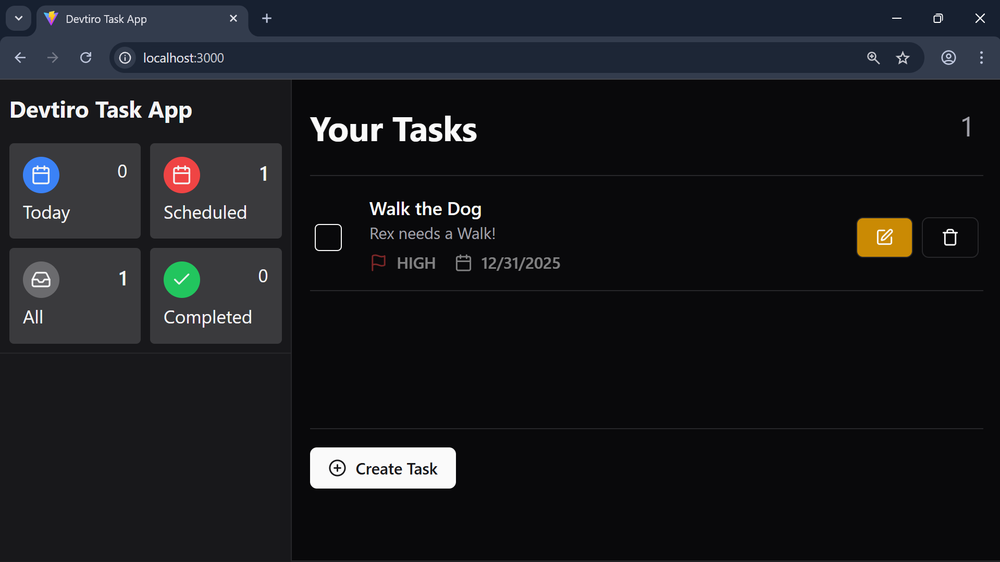

1. Click the edit button on the task you wish to edit. This brings up a dialog
   to edit the existing task.

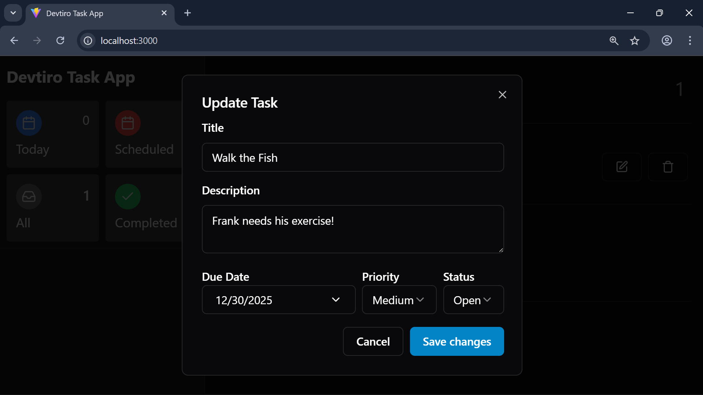

2. You'll see all the task's existing details. Edit each field. Click the
   "Save Changes" button.

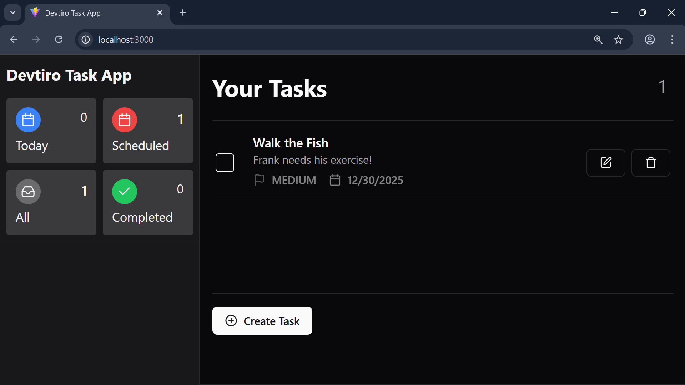

3. You'll see the updated task in the task list.

#### Summary

- Updated a task using the UI.

## Delete Task Feature

### Service Layer

Let's code the delete task business logic in our service layer.

#### Update the Task Service

In `TaskService` we'll add our last method definition:

```java
  /**
   * Deletes the specified task.
   * Does not throw an exception when the specified task does not exist.
   *
   * @param taskId The ID of the task to delete.
   */
  void deleteTask(UUID taskId);
```

This method takes the ID of the task to delete and doesn't return anything.

You may be wondering what we should do when the user tries to delete a task
that doesn't exist. In this case, we **won't throw an exception**.

Think of it this way, regardless of whether the task existed in the first place,
after calling this method it definitely won't exist.

Perhaps a bit counterintuitive, but this is the way a lot of REST APIs
implement delete, so we'll follow in our service layer too!

Now to implement the delete task method.

#### Implement the Delete Task Method

Over in `TaskServiceImpl`, let's implement our new method:

```java
  @Transactional
  @Override
  public void deleteTask(UUID taskId) {
    taskRepository.deleteById(taskId);
  }
```

The implementation is just a single line! We're delegating all of the
responsibility of deleting a task to the task repository. We sometimes call this
a "pass through" implementation. Another example of all the functionality
repositories offer out of the box!

That's the service layer complete, let's move on to the presentation layer.

#### Summary

- Added the `deleteTask` method to the `TaskService` interface.
- Implemented the `deleteTask` method.

### Delete Task Endpoint

Let's implement our last REST API endpoint, the delete task endpoint!

#### Implement the Delete Task Endpoint

The `TaskController` class is almost complete, just one last endpoint to add:

```java
  /**
   * Deletes the specified Task.
   * Always returns an HTTP 204 NO CONTENT.
   *
   * @param taskId The ID of the task.
   * @return An HTTP 204 NO CONTENT.
   */
  @DeleteMapping(path = "/{taskId}")
  public ResponseEntity<Void> deleteTask(@PathVariable UUID taskId) {

    // Call the deleteTask method on the TaskService.
    taskService.deleteTask(taskId);

    // Return an HTTP 204 NO CONTENT.
    return new ResponseEntity<>(HttpStatus.NO_CONTENT);

  }
```

Note the `Void` in the `ResponseEntity`. This is used when there is no response
body, which is exactly what we expect for a `HTTP 204 NO CONTENT`.

This endpoint expects the task ID in the URL path. The framework extracts the
task ID from the URL path and passes it to the `deleteTask` method.

Let's try out the delete task endpoint in the UI!

#### Summary

- Implemented the `deleteTask` method on the `TaskController` class.

### Ui Testing

Now we've coded the delete task endpoint, let's test this final feature in the
UI.

Let's head over to `http://localhost:3000` in our browser.

#### Delete a Task

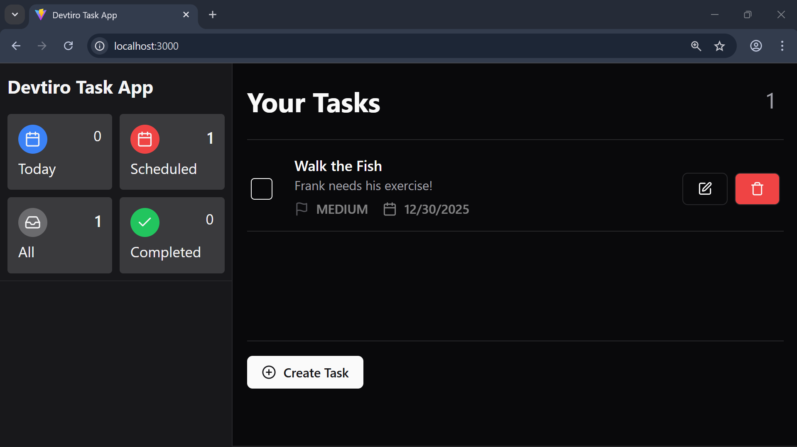

1. Click the delete button next to the task you wish to delete. This brings
   up the task delete dialog.

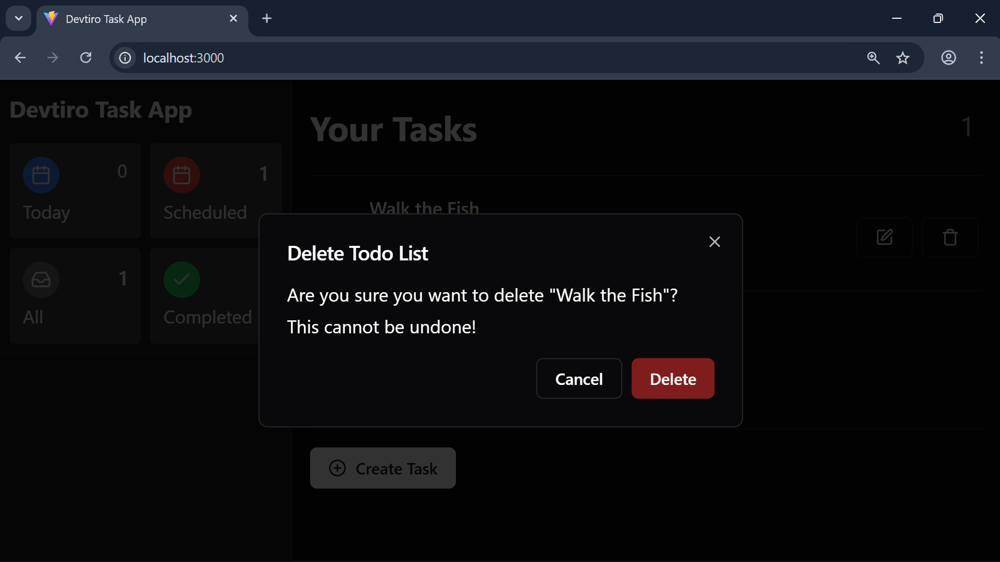

2. Click the "Delete" button to delete the task.

There we have it, the delete task feature is working as expected!

#### Summary

- Deleted a task using the UI.

## What Next

### Next Steps

If you've made it this far, congratulations!

Building an app from start to finish isn't easy, this is a huge accomplishment.
Well done!

Now, where do you go from here?

#### Upload Your Code to GitHub

Why not upload your finished app to GitHub? This is a great way to show off
your accomplishment to the world!

> [!CAUTION]
> Please only upload your code! It's not permitted to upload this book.

All I ask, is that you mention Devtiro in your `README` file. This allows me
to reach, and help, more people.

Perhaps something small like:

```markdown
[Built with Devtiro](https://www.youtube.com/@devtiro).
```

I appreciate it!
